

# **Giải bài toán 8-Puzzle**
## Đồ án cá nhân môn Trí tuệ nhân tạo

### Sinh viên thực hiện
  **Họ và tên:** Nguyễn Hoàng Hà

  **MSSV:** 23110207

  **Giảng viên hướng dẫn:** TS. Phan Thị Huyền Trang

## Mục lục
  [I. **Giới thiệu**](#i-giới-thiệu)

  [II. **Bài toán 8-Puzzle là gì?**](#ii-bài-toán-8-puzzle-là-gì)

  [III. Mục tiêu](#iii-mục-tiêu)

  [IV. **Yêu cầu hệ thống**](#iv-yêu-cầu-hệ-thống)

  [V. Nội dung dự án](#v-nội-dung-dự-án)
  - [1. **Hướng dẫn sử dụng**](#1-hướng-dẫn-sử-dụng)
    - [1.1 **Cách thiết lập trạng thái ban đầu**](#11-cách-thiết-lập-trạng-thái-ban-đầu)
    - [1.2. **Chạy các thuật toán**](#12-chạy-các-thuật-toán)
    - [1.3. **Điều khiển quá trình giải**](#13-điều-khiển-quá-trình-giải)
  - [2. **Phân tích kết quả**](#2-phân-tích-kết-quả)
  
  [VI. **Các thuật toán tìm kiếm**](#vi-các-thuật-toán-tìm-kiếm)
    - [1. **Nhóm thuật toán tìm kiếm không có thông tin (Uninformed Search/Blind Search)**](#1-nhóm-thuật-toán-tìm-kiếm-không-có-thông-tin-uninformed-searchblind-search)
      - [1.1. Breadth-First Search (BFS - Tìm kiếm theo chiều rộng):](#11-breadth-first-search-bfs---tìm-kiếm-theo-chiều-rộng)
      - [1.2. Depth-First Search (DFS - Tìm kiếm theo chiều sâu)](#12-depth-first-search-dfs---tìm-kiếm-theo-chiều-sâu)
      - [1.3. Uniform Cost Search (UCS)](#13-uniform-cost-search-ucs)
      - [1.4. Iterative Deepening Depth - First Search (IDS)](#14-iterative-deepening-depth---first-search-ids)
      - [1.5. Kết luận](#15-kết-luận)
    - [2. **Nhóm thuật toán tìm kiếm có thông tin**](#2-nhóm-thuật-toán-tìm-kiếm-có-thông-tin)
      - [**Đây là nhóm thuật toán sử dụng thông tin heuristic để ưu tiên khám phá các trạng thái có khả năng dẫn đến mục tiêu nhanh hơn**](#đây-là-nhóm-thuật-toán-sử-dụng-thông-tin-heuristic-để-ưu-tiên-khám-phá-các-trạng-thái-có-khả-năng-dẫn-đến-mục-tiêu-nhanh-hơn)
      - [**Đặc điểm:**](#đặc-điểm)
      - [2.1. Greedy Best-First Search(GBFS - Tìm kiếm tham lam theo ưu tiên):](#21-greedy-best-first-searchgbfs---tìm-kiếm-tham-lam-theo-ưu-tiên)
      - [2.2. A\* Search(Tìm kiếm A\*)](#22-a-searchtìm-kiếm-a)
      - [2.3. Iterative Deepening A (IDA\* - A\* lặp sâu):](#23-iterative-deepening-a-ida---a-lặp-sâu)
      - [2.4. Kết luận :](#24-kết-luận-)
    - [3. **Nhóm thuật tìm kiếm toán cục bộ**](#3-nhóm-thuật-tìm-kiếm-toán-cục-bộ)
      - [Đây là thuật toán không khám phá toàn bộ trạng thái mà tập trung vào việc tập trung cải thiện một trạng thái hiện tại, thường dùng cho các bài toán tối ưu](#đây-là-thuật-toán-không-khám-phá-toàn-bộ-trạng-thái-mà-tập-trung-vào-việc-tập-trung-cải-thiện-một-trạng-thái-hiện-tại-thường-dùng-cho-các-bài-toán-tối-ưu)
      - [Đặc điểm:](#đặc-điểm-1)
      - [3.1. Hill ClimBing(Leo đồi)](#31-hill-climbingleo-đồi)
      - [3.2. Stochastic Hill ClimBing (Leo đôi ngẫu nhiên):](#32-stochastic-hill-climbing-leo-đôi-ngẫu-nhiên)
      - [3.3. Simulated Annealing (Ủ nhiệt mô phỏng)](#33-simulated-annealing-ủ-nhiệt-mô-phỏng)
      - [3.4. Beam Search (Tìm kiếm chùm):](#34-beam-search-tìm-kiếm-chùm)
      - [3.5. Genetic algorithm (thuật toán di truyền):](#35-genetic-algorithm-thuật-toán-di-truyền)
      - [3.6. Kết luận:](#36-kết-luận)
    - [4. **Nhóm thuật toán tìm kiếm trong môi trường không xác định**](#4-nhóm-thuật-toán-tìm-kiếm-trong-môi-trường-không-xác-định)
      - [Nondeterministic Enviroments : Đây là nhóm thuật toán được thiết kế để xử lý các bài toán mà kết quả của một hành động không chắc chắn (có thể dẫn đến nhiều trạng thái khác nhau)](#nondeterministic-enviroments--đây-là-nhóm-thuật-toán-được-thiết-kế-để-xử-lý-các-bài-toán-mà-kết-quả-của-một-hành-động-không-chắc-chắn-có-thể-dẫn-đến-nhiều-trạng-thái-khác-nhau)
      - [4.1. And-or search](#41-and-or-search)
      - [4.2. Belief Search(Tìm kiếm dựa trên niềm tin)](#42-belief-searchtìm-kiếm-dựa-trên-niềm-tin)
      - [4.3. Kết luận:](#43-kết-luận)
    - [5. **Nhóm thuật toán có ràng buộc điều kiện**](#5-nhóm-thuật-toán-có-ràng-buộc-điều-kiện)
      - [Định nghĩa:](#định-nghĩa)
      - [5.1. Backtracking Search (Tìm kiếm quay lui):](#51-backtracking-search-tìm-kiếm-quay-lui)
      - [5.2. AC-3](#52-ac-3)
      - [5.3. generate\_all\_states](#53-generate_all_states)
      - [5.4. Kết luận:](#54-kết-luận)
    - [6. Nhóm thuật toán Reinforcement Learning - RL (học củng cố)](#6-nhóm-thuật-toán-reinforcement-learning---rl-học-củng-cố)
      - [6.1. Q-Learning](#61-q-learning)
      - [Kết luận:](#kết-luận)
  - [VII. Kết luận](#vii-kết-luận)

## I. **Giới thiệu**
8-Puzzle Solver là 1 ứng dụng đồ họa cho phép giải quyết bài toán 8-Puzzle bằng nhiều thuật toán tìm kiếm khác nhau. Ứng dụng cung cấp giao diện trực quan để theo dõi quá trình giải quyết, so sánh hiệu suất giữa các thuật toán và xuất kết quả để phân tích.

## II. **Bài toán 8-Puzzle là gì?**
Bài toán 8-Puzzle là một trò chơi di chuyển các ô số trên bảng 3x3, trong đó có 8 được đánh số từ 1 - 8 và 1 ô trống. Người chơi chỉ có thể di chuyển các ô liền kề với ô trống vào vị trí của ô trống. Mục tiêu là sắp xếp các ô về trạng thái mục tiêu mà người chơi đề ra. 
Trong ứng dụng này, trạng thái đích là:

              | 1 | 2 | 3 |
              | 4 | 5 | 6 |
              | 7 | 8 | 0 |

## III. Mục tiêu
* **Đa dạng thuật toán:** BFS,DFS,UCS,GBFS,A*,IDA*,Hill ClimBing,Stochastic Hill Climbing, Simulated Anealing, Beam Search, And or search , Belief Enviroment Search, BackTracking,......
* **Giao diện trực quan:** Theo dõi các trạng thái bắt đầu, hiện tại và đích
* **Điều khiển bước giải:** Chạy từng bước, tự động chạy, quay ngược bước trước
* **Tùy chỉnh trạng thái ban đầu:** Nhập trạng thái 8-Puzzle tùy chọn
* **Thống kê chi tiết:** So sánh thời gian thực thi, số bước thực hiện, chi phí và không gian tìm kiếm giữa các thuật toán
* **Trực quan hóa dữ liệu**: Tạo biểu đồ so sánh hiệu suất giữa các thuật toán
* **Xuất kết quả:** Lưu kết quả và đường đi vào file Excel để tiện cho phân tích sau này
## IV. **Yêu cầu hệ thống**
Môi trường Python
Các thư viện: 
  * Tkinter(GUI)
  * pandas (Xử lý dữ liệu)
  * matplotlib (Trực quan hóa)
  * Các thư viên chuẩn khác : time, copy, collections, heapq
## V. Nội dung dự án
### 1. **Hướng dẫn sử dụng**
#### 1.1 **Cách thiết lập trạng thái ban đầu**
Trạng thái ban đầu (mặc định):

         | 1 | 6 | 2 |
         | 5 | 7 | 4 |
         | 8 | 3 | 0 |
1. Nhập các giá trị có giá từ 0-8 vào lưới "Start State" (0 đại diện cho ô trống hoặc không nhập gì)
2. Nhấn nút "Update Start" để cập nhật lại trạng thái ban đầu
   
   
#### 1.2. **Chạy các thuật toán**
1. Chọn thuật toán từ menu dropdown (BFS,DFS,UCS,...) hoặc các thuật toán có hướng xử lý khác ở bên ngoài menu
   
   
2. Nhấn nút "Run Algorithm" để thực thi thuật toán
3. Theo dõi tiến trình giải quyết trên giao diện "Current State"
#### 1.3. **Điều khiển quá trình giải**
  * **Next Step:** Di chuyển đến bước tiếp theo trong giải pháp
  * **Back Step:** Quay lại bước trước đó
  * **Auto Run:** Tự động thực hiện các bước với tốc độ 1 bước/giây
  * **Stop:** Dừng chế độ tự động chạy
  

### 2. **Phân tích kết quả**
  * **Export:** Lưu đường đi giải quyết vào file Excel
  * **Plot Graph:** Tạo biểu đồ so sánh hiệu suất giữa các thuật toán đã chạy
  
## VI. **Các thuật toán tìm kiếm**
### 1. **Nhóm thuật toán tìm kiếm không có thông tin (Uninformed Search/Blind Search)**
#### 1.1. Breadth-First Search (BFS - Tìm kiếm theo chiều rộng):
   * Cách hoạt động: Khám phá tất cả các trạng thái ở cùng một mức (level) trước khi đi sâu hơn. Sử dụng hàng đợi (queue) để mở rộng các trạng thái theo thứ tự từ gần nhất cho đến xa nhất so với trạng thái ban đầu.
   * Ưu điểm:
     * Đảm bảo tìm được đường đi ngắn nhất (chi phí mỗi bước là như nhau) nếu bài toán có lời giải.
     * Dễ triển khai : Cấu trúc hàng đợi và tập hợp các điểm đã thăm
   * Nhược điểm:
     * Tốn nhiều bộ nhớ vì phải lưu tất cả trạng thái ở mỗi mức.
     * Thời gian chạy có thể chậm nếu độ sâu của giải pháp lớn.
   *  Độ phức tạp:
     * **Thời gian**: \( O(b^d) \), trong đó \( b \) là nhánh trung bình (tối đa 4 trong 8-puzzle: lên, xuống, trái, phải), và \( d \) là độ sâu của trạng thái mục tiêu. Với 8-puzzle, \( b \) thường là 2-3 (do một số di chuyển không hợp lệ), và \( d \) có thể lên đến 31 (độ sâu tối đa cho một số trạng thái).
     * Bộ nhớ: \( O(b^d) \), vì BFS phải lưu trữ tất cả các trạng thái ở độ sâu hiện tại trong hàng đợi. 

        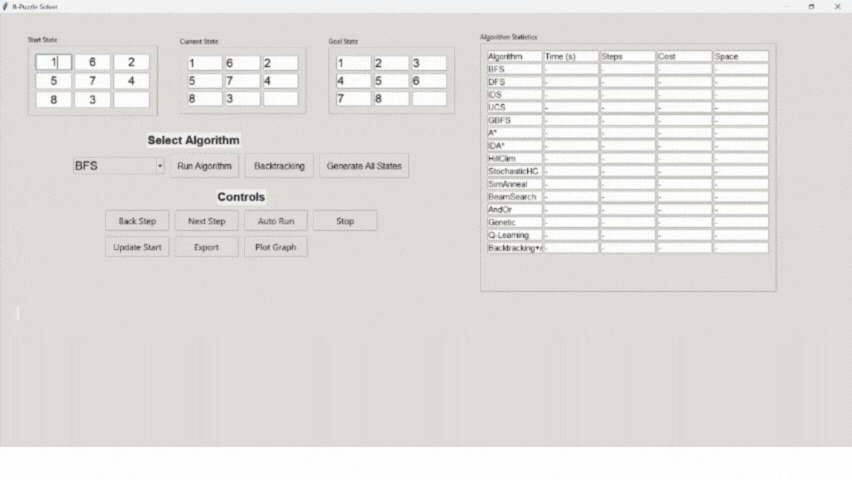

#### 1.2. Depth-First Search (DFS - Tìm kiếm theo chiều sâu)
   * Cách hoạt động: Khám phá một nhánh đến tận cùng trước khi quay lại và thử nhánh khác. Thuật toán sử dụng ngăn xếp (stack) hoặc đệ quy để quản lý các trạng thái cần mở rộng.
   * Ưu điểm:
     * Tốn ít bộ nhớ hơn BFS vì chỉ lưu một nhánh tại 1 thời điểm
     * Hiệu quả trong không gian hẹp khi giải pháp nằm ở độ sâu lớn nhưng không cần đường đi ngắn nhất
     * Dễ triển khai: Có thể dùng ngăn xếp hoặc đệ qui
   * Nhược điểm:
     * Không đảm bảo tìm được đường đi ngắn nhất, có thể bị mắc kẹt
     * Thời gian chạy không ổn định: Nếu giải pháp nằm ở nhánh cuối hoặc không tồn tại, DFS có thể sẽ mất nhiều thời gian để khám phá toàn bộ không gian trạng thái.
     * Trong trường hợp không giới hạn độ sâu : DFS có thể mắc kẹt ở các nhánh hoặc quá sâu
   * Độ phức tạp:
      * Thời gian: \( O(b^d) \), trong đó \( b \) là nhánh trung bình (tối đa 4 trong 8-puzzle), và \( d \) là độ sâu tối đa của cây tìm kiếm (có thể lên đến \( 9! = 362,880 \) nếu không cắt tỉa).
      * Bộ nhớ: \( O(d) \), vì DFS chỉ lưu trữ các trạng thái trên nhánh hiện tại.
  
      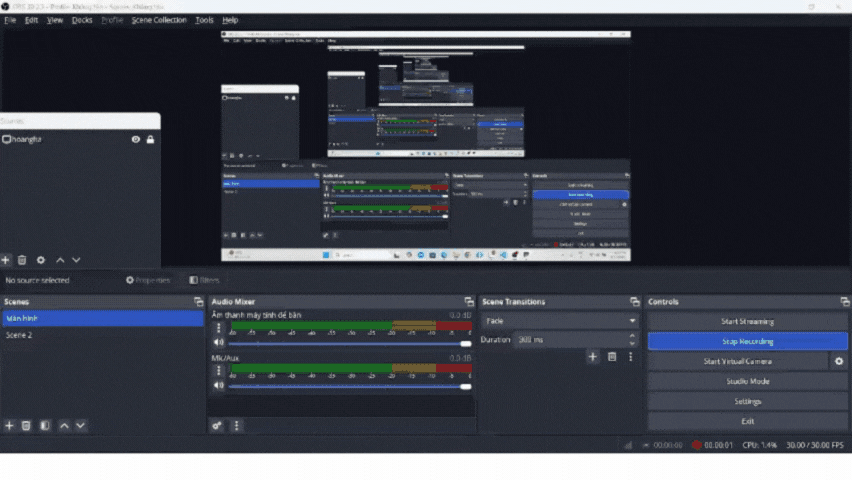

#### 1.3. Uniform Cost Search (UCS)
   * Cách hoạt động: Mở rộng trạng thái có tổng chi phí thấp nhất từ trạng thái ban đầu (dựa vào chi phí đường đi không dựa trên heuritic), sử dụng hàng đợi ưu tiên để đảm bảo trạng thái với chi phí thấp được xử lý trước.
   * Ưu điểm:
     * Đảm bảo tìm được đường đi tối thiểu nếu chi phí mỗi bước là  như nhau
     * Nếu lời giải tồn tại , UCS chắc chắn tìm được
     * Linh hoạt với các chi phí khác nhau, có thể xử lí được với các trường hợp chi phí không đồng nhất.
   * Nhược điểm:
     * Tương tự BFS, tốn nhiều bộ nhớ vì phải lưu trữ tất cả trạng thái trong hàng đợi ưu tiên.
     * Không hiệu quả với không gian trạng thái lớn.
   * Trong úng dụng này, chi phí của mỗi bước di chuyển là như nhau
   * Độ phức tạp:
      * Thời gian: \( O(b^{C*/ε}) \), trong đó \( b \) là nhánh trung bình, \( C* \) là chi phí của đường đi tối ưu, và \( ε \) là chi phí nhỏ nhất của một bước (\( ε = 1 \) trong 8-puzzle, nên tương đương \( O(b^d) \)).
      * Bộ nhớ: \( O(b^{C*/ε}) \), tương tự BFS.

      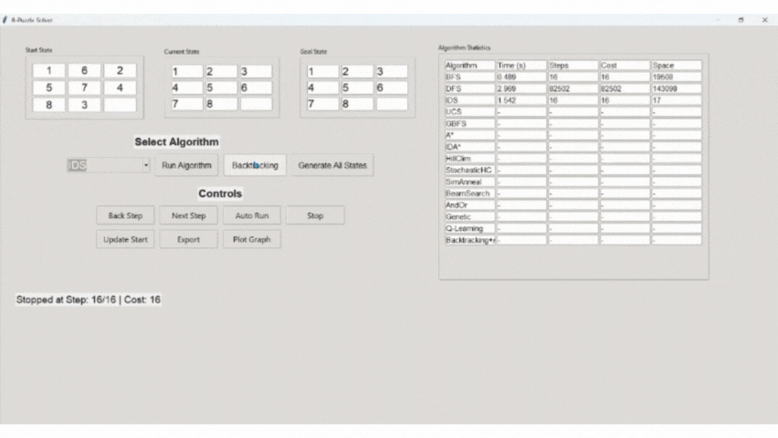

#### 1.4. Iterative Deepening Depth - First Search (IDS)
  * Cách hoạt  động: IDS là một biến thể của DFS , thực hiện tìm kiếm theo chiều sâu với giới hạn độ sâu tăng dần cho đến khi tìm thấy trạng thái mục tiêu.
  * Đặc điểm nổi bật:
    * Kết hợp tính tối ưu và đầy đủ của BFS với yêu cầu bộ  nhớ thấp của DFS
    * Khám phá các trạng thái tương tự BFS (mức độ sâu tăng dần)
  * Ưu điểm:
    * Đảm bảo tìm được đường đi ngắn nhất vì nó khám phá các trạng thái theo mức độ chiều sâu tăng dần..
    * Bộ nhớ thấp: chỉ lưu trữ trạng thái trên đường đi hiện tại, tương tự DFS
  * Nhược điểm:
    * Chậm hơn BFS do phải lặp lại tìm kiếm nhiều dần , những trạng thái có thể được thăm nhiều lần
    * Chi phí tính toán tăng do khám phá lại các trạng thái ở các mức độ sâu thấp hơn.

        

#### 1.5. Kết luận

  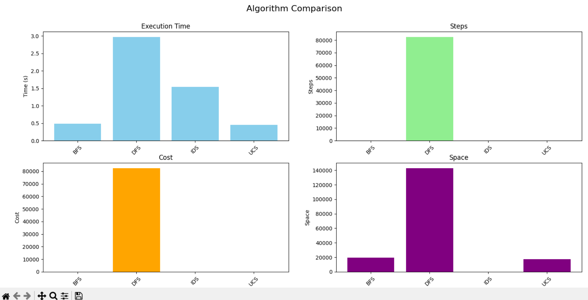

   * So sánh giữa các thuật toán
     * Dựa trên phân tích , BFS là thuật toán tìm kiếm không có thông tin phù hợp nhất cho bài toán 8 Puzzle vì :
       * Tính tối ưu : BFS đảm bảo tìm được đường đi ngắn nhất , đáp ứng nhu cầu của bài toán
       * Tính đầy đủ : BFS luôn tìm được lời giải nếu trạng thái ban đầu có thể đạt được trạng thái mục tiêu
       * Hiệu quả trong chi phí đồng nhất : Vì mỗi di chuyển trong 8 Puzzle có chi phí 1, BFS hoạt động hiệu quả hơn UCS (không cần hàng đợi ưu tiên phức tạp)
       * Ứng dụng thực tế: Trong 8 Puzzle, BFS cung cấp kết quả nhanh
     * Lý do loại bỏ các thuật toán khác:
       * DFS: không phù hợp do không tối ưu (đường đi dài) và không đầy đủ nếu không kiểm soát độ sâu. Kết quả thường không đáp ứng yêu cầu tìm đường đi ngắn nhất, thời gian chạy không ổn định
       * UCS: Mặc dù tối ưu và đầy đủ nhưng UCS chậm hơn BFS trong 8 Puzzle do tính toán chi phí của hàng đợi ưu tiên, trong khi không mang lại lợi thế vì chi phí di chuyển đồng nhất
       * IDS : Tối ưu, tiết kiệm bộ nhớ hơn BFS/UCS nhưng chậm hơn do lặp lại. Phù hợp khi muốn tìm đường đu ngắn nhất nhưng tài nguyên bộ nhớ hạn chế

### 2. **Nhóm thuật toán tìm kiếm có thông tin**
#### **Đây là nhóm thuật toán sử dụng thông tin heuristic để ưu tiên khám phá các trạng thái có khả năng dẫn đến mục tiêu nhanh hơn**
#### **Đặc điểm:**
  * Sử dụng hàm heuristic (hàm ước lượng khảng cách từ trạng thái hiện tại đến trạng thái mục tiêu) để định hướng tìm kiếm
  * Nhanh hơn các thuật toán không có thông tin nhưng không phải lúc nào cũng đảm bảo tính tối ưu
  * **Hàm heuristic** được sử dụng trong bài toán: Tổng khoảng cách Manhattan (theo hàng và cột) của mỗi ô từ vị trí hiện tại đến vị trí mục tiêu
#### 2.1. Greedy Best-First Search(GBFS - Tìm kiếm tham lam theo ưu tiên):
   * Cách hoạt động: Chỉ dựa vào hàm heuristic để chọn trạng thái tiếp theo (trạng thái có giá trị heuristic tốt nhất với vấn đề), sử dụng hàng đợi ưu tiên để đảm bảo trạng thái với heuristic thấp nhất được xử lý trước.
   * Ưu điểm:
     * Nhanh vì chỉ tập trung vào các trạng thái "hứa hẹn" nhất.
     * Tiêu tốn ít bộ nhớ hơn BFS nếu heuristic tốt, vì chỉ tập trung vào các trạng thái "hứa hẹn".
   * Nhược điểm:
     * không đảm bảo tối ưu (có thể mắc kẹt).
     * Hiệu quả phụ thuộc nhiều vào chất lượng của heuristic; nếu heuristic không tốt, có thể bị mắc kẹt.
   * Độ phức tạp:
     * Thời gian: \( O(b^d) \), trong đó \( b \) là nhánh trung bình, và \( d \) là độ sâu tối đa của cây tìm kiếm. Phụ thuộc vào chất lượng heuristic.
     * Bộ nhớ: \( O(b^d) \), nhưng thường ít hơn BFS nếu heuristic hiệu quả. 
  
     * 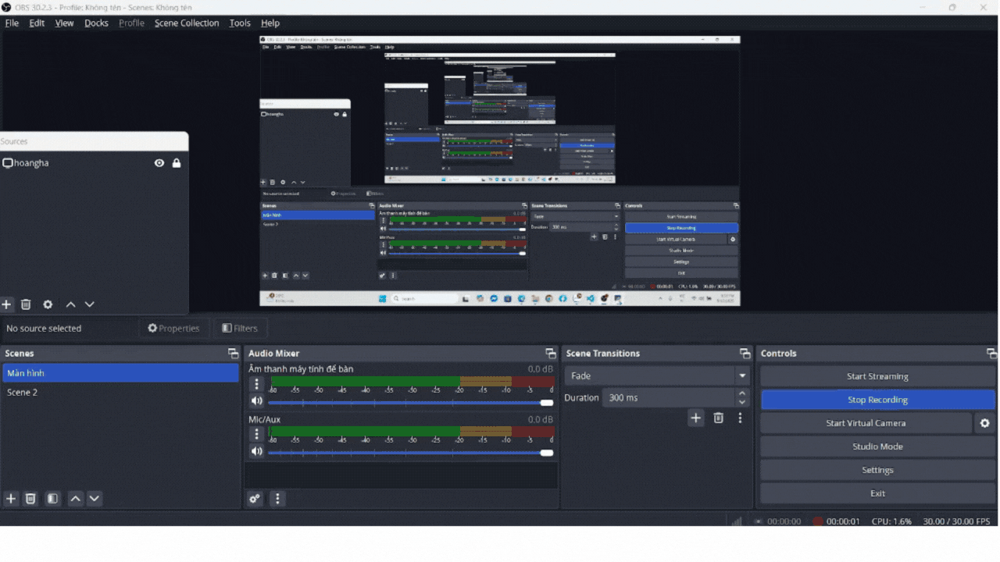
  
#### 2.2. A* Search(Tìm kiếm A*)
   * Cách hoạt động: A* Search là một thuật toán tìm kiếm có thông tin, kết hợp chi phí đã đi \( g \) (từ trạng thái ban đầu đến trạng thái hiện tại) với giá trị heuristic \( h \) (ước lượng chi phí từ trạng thái hiện tại đến mục tiêu) để tìm đường đi tối ưu. Thuật toán sử dụng hàng đợi ưu tiên (priority queue) .Kết hợp chi phí đã đi (g) và heuristic (h): f(n)=g(n)+h(n). Mở rộng trạng thái có giá trị f(n) thấp nhất.
   * Hiệu quả: Kết hợp chi phí đường đi g(n) và heuristic h(n) để giảm số trạng thái khám phá so với các thuật toán không có thông tin.
   * Ưu điểm:
     * Đảm bảo tìm được đường đi tối ưu nếu hàm heuristic là "admissible" (không bao giờ đánh giá quá cao so với thực tế).
     * Hiệu quả hơn BFS và UCS nhờ heuristic định hướng tìm kiếm, giảm số trạng thái cần duyệt.
     * Hoàn chỉnh (luôn tìm được giải pháp nếu nó tồn tại).
   * Nhược điểm:
     * Khá tốn bộ nhớ vì phải lưu trữ tất cả trạng thái trong hàng đợi ưu tiên
     * Thời gian chạy phụ thuộc vào chất lượng heuristic; nếu heuristic kém, hiệu suất có thể giảm.
     * Quản lý hàng đợi ưu tiên phức tạp hơn so với hàng đợi FIFO hoặc ngăn xếp.
   * Độ phức tạp:
     * Thời gian: \( O(b^d) \), nhưng thường nhanh hơn BFS nhờ heuristic. Số trạng thái duyệt qua phụ thuộc vào chất lượng của \( h \).
     * Bộ nhớ: \( O(b^d) \), tương tự BFS, nhưng số trạng thái lưu trữ thường ít hơn nhờ heuristic. 
  
     * 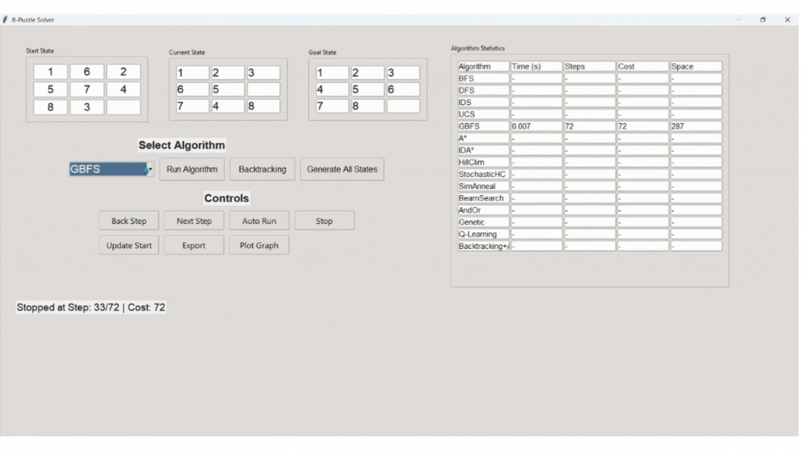
  
#### 2.3. Iterative Deepening A (IDA* - A* lặp sâu):
  *  Cách hoạt động: Kết hợp ý tưởng của Iterative Deepening (tăng dần giới hạn độ sâu) với A*. Mỗi vòng lặp sử dụng một ngưỡng f(n) để giới hạn tìm kiếm
  *  Ưu điểm:
    * Tốn ít bộ nhớ hơn A* vì chỉ lưu trữ các trạng thái trên nhánh hiện tại.
    * Dàm bảo đường đi ngắn nhất nếu có lời giải
  *  Nhược điểm:
    * Có thể lặp lại việc khám phá trạng thái, dẫn đến thời gian chạy lâu hơn A*
    * Hiệu quả phụ thuộc vào chất lượng heuristic.
  * Độ phức tạp:
    * Thời gian: \( O(b^d) \), nhưng có thể chậm hơn A* do lặp lại.
    * Bộ nhớ: \( O(d) \), tiết kiệm hơn A*.
  
    * 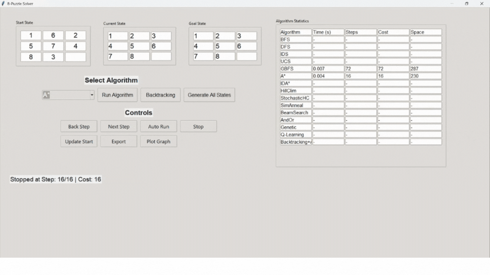
   
#### 2.4. Kết luận : 

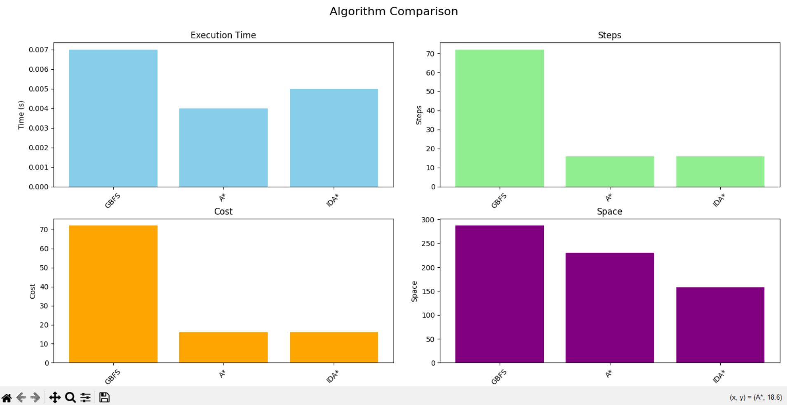

* Nếu ưu tiên hiệu suất và đường đi ngắn nhất: A* là lựa chọn tốt nhất vì:
  * Tối ưu, đầy đủ và nhanh nhất
  * Khám phá ít trạng thái nhất
  * Mức độ ổn định
* Nếu bộ nhớ hạn chế , nên chọn IDA* vì:
  * Tối ưu và đầy đủ như A*
  * Tiết kiệm bộ nhớ
  * Thời gian chấp nhận được dù châm hợn A*
* Nếu ưu tiên tốc độ cao và chấp nhận đường đi không tối ưu, chọn GBFS vì:
  * Nhanh vì tập trung hướng đến các điểm hứa hẹn
  * Đường đi dài hơn nhưng vẫn khả thi
  * Bộ nhớ ổn định   
### 3. **Nhóm thuật tìm kiếm toán cục bộ**
#### Đây là thuật toán không khám phá toàn bộ trạng thái mà tập trung vào việc tập trung cải thiện một trạng thái hiện tại, thường dùng cho các bài toán tối ưu
#### Đặc điểm:
  * Bắt đầu từ một trạng thái ban đầu và cải thiện dần trạng thái đó theo một tiêu chí (thường là heuristic)
  * Không đảm bảo tìm được lời giải tối ưu toàn cục, nhưng nhanh và hiệu quả ở các bài toán lớn 
  * Không lưu trữ nhiều trạng thái, chỉ làm việc với một hoặc hai trạng thái tại 1 thời điểm
#### 3.1. Hill ClimBing(Leo đồi)
  * Cách hoạt động: Từ trạng thái hiện tại, chọn trạng thái láng giềng có giá trị heuristic tốt nhất (giảm nhất). Lặp lại cho đến khi không thể cải thiện thêm. Chỉ dựa trên heuristic, tương tự GBFS nhưng không khám phá nhiều trạng thái cùng lúc.
  * Ưu điểm:
    * Rất nhanh, vì chỉ xem xét các trạng thái lân cận.
    * Tiết kiệm bộ nhớ, chỉ lưu trữ trạng thái hiện tại.
    * Hiệu quả trong trường hợp đơn giản: Nếu trạng thái gần mục tiêu, Hill Climbing có thể tìm được giải pháp nhanh chóng.
  * Nhược điểm:
    * Dễ bị mắc kẹt ở "đỉnh tối ưu cục bộ" (local optima)
    * Không đảm bảo tìm được mục tiêu
    * Hiệu suất phụ thuộc vào hàm heuristic
    * Nếu trạng thái ban đầu xa mục tiêu hoặc nằm trong vùng dễ mắc kẹt cục bộ, Hill Climbing thường không tìm ra lời giải
  * 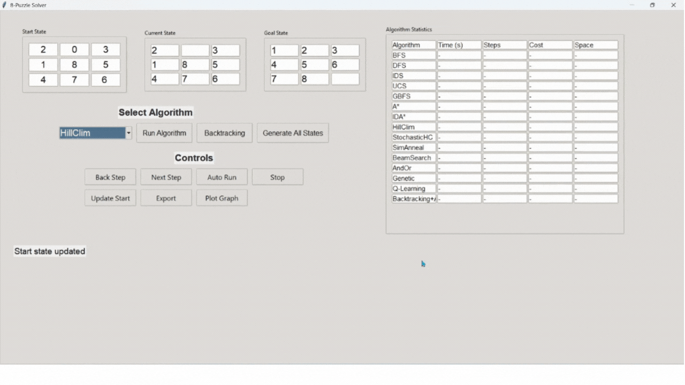
#### 3.2. Stochastic Hill ClimBing (Leo đôi ngẫu nhiên):
  * Cách hoạt động: Tương tự Hill ClimBing, nhưng thay vì chọn láng giềng tốt nhất thì chọn ngẫu nhiên một láng giềng có giá trị tổt hơn.
  * Ưu điểm:
    * Giảm khả năng bị mắc kẹt ở tối ưu cục bộ so với Hill Climbing thông thường
    * Vẫn nhanh và tốn ít bộ nhớ
    * Dễ triển khai, chỉ cần heuristic và logic chọn ngẫu nhiên dựa trên xác suất
  * Nhược điểm:
    * Không đảm bảo được tính tối ưu và hoàn chỉnh
    * Tính ngẫu nhiên không kiểm soát: Việc chọn ngẫu nhiên có thể dẫn đến chọn trạng thái kém hơn và làm tăng số bước không cần thiết.
    *  Nếu trạng thái ban đầu xa mục tiêu hoặc nằm trong vùng dễ mắc kẹt cục bộ, Hill Climbing thường không tìm ra lời giải
  *  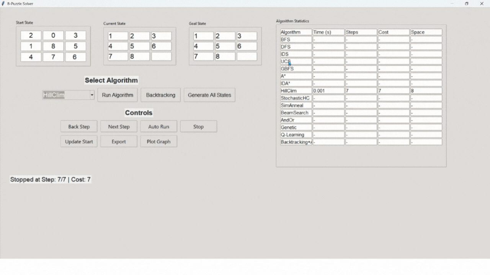
#### 3.3. Simulated Annealing (Ủ nhiệt mô phỏng)
  * Cách hoạt động: Giống Hill ClimBing, nhưng trong trường tất cả các láng giềng đều có giá trị xấu hơn trạng thái hiện tại, chấp nhận các bước xấu (trạng thái con tệ hơn) với xác suất phụ thuộc vào "nhiệt độ" (temperature). Nhiệt độ giảm dần theo thời gian.
  * Đặc điểm nổi bật:
    * Thoát cực trị cục bộ: Cơ chế chấp nhận trạng thái kém hơn với xác suất giảm dần giúp vượt qua cực trị cục bộ, cải thiện so với  Hill ClimBing và Stochastic Hill ClimBing.
    * Linh hoạt : Có thể điều chỉnh nhiệt độ ban đầu, lịch trình làm nguội và xác suất chấp nhận để cân bằng.
  * Ưu điểm:
    * Có khả năng thoát khỏi tối ưu cục bộ nhờ cơ chế ngẫu nhiên.
    * Linh hoạt, có thể điều chỉnh lịch làm nguội để cân bằng tốc độ và chất lượng.
    * Tốn ít bộ  nhớ do chỉ lưu trạng thái hiện tại và các trạng thái lân cận.
    * hiệu quả trong các bài toán phức tạp và không gian lớn.
  * Nhược điểm:
    * Cần điều chỉnh tham số (nhiệt độ ban đầu, tốc độ giảm nhiệt) để đạt được hiệu quả
    * Không đảm bảo tính tối ưu hoặc hoàn chỉnh trong thời gian hữu hạn.
  * 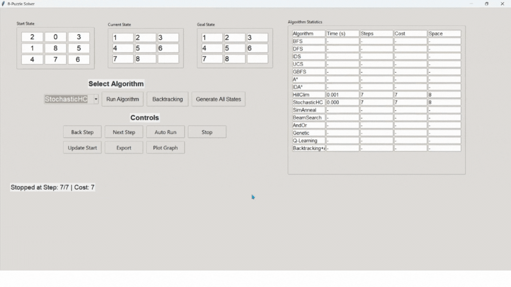
#### 3.4. Beam Search (Tìm kiếm chùm): 
  * Cách hoạt động: Kết hợp ý tưởng của BFS và tìm kiếm cục bộ. Chỉ giữ lại một số lượng cố định (beam width) các trạng thái tổt nhất với mỗi mức.
  * Đặc điểm nổi bật:
    * Giới hạn khám phá: Chỉ giữ lại trạng thái tốt nhất ở mỗi mức độ sâu, giảm đáng kể bộ nhớ so với BFS và A*.
    * Beam width cho phép điều chỉnh mức độ chi tiết của tìm kiếm. 
  * Ưu điểm:
    * Tiết kiệm bộ nhớ so với BFS, nhanh hơn nhờ giới hạn trạng thái
    * Nhanh hơn nếu \( k \) nhỏ, phù hợp với các bài toán lớn.
    * Điều chỉnh linh hoạt, beamwidth(k) nhỏ thì nhanh, lớn thì chính xác hơn - dễ dàng cân bằng giữa tốc độ và độ chính xác.
  * Nhược điểm:
    * Không đảm bảo tối ưu, có thể bỏ sót trạng thái dẫn đến mục tiêu.
    * Nếu đi sai hướng thì không thể quay đầu
    * Hiệu quả phụ thuộc vào giá trị \( k \): Nếu k quá nhỏ, thuật toán trở nên quá tham lam; nếu quá lớn, tốn bộ nhớ và thời gian.
    * Hiệu quả phụ thuộc vào chất lượng heuristic.
  * 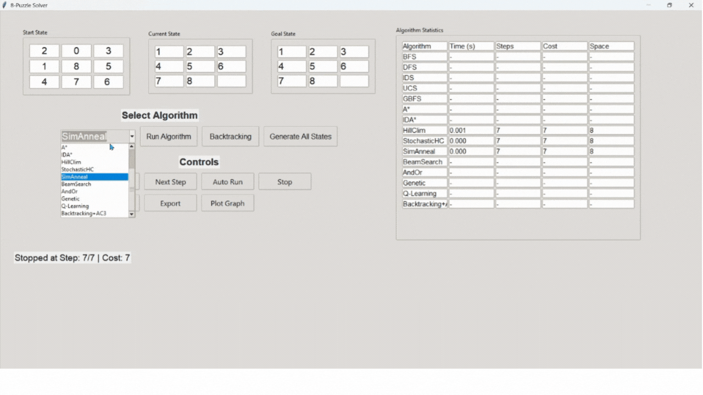
#### 3.5. Genetic algorithm (thuật toán di truyền):
  * Cách hoạt động : Quá trình chọn lọc tự nhiên để tìm kiếm giải pháp tối ưu hoặc gần tối ưu.
    * Quần thể : Tập hợp các cá thể, mỗi cá thể là trạng thái bảng 3x3
    * Hàm đánh giá : Đo lường mức độ gần gũi của cá thể so với trạng thái mục tiêu.
    * Tiến hóa:
      * Selection : Chọn các cá thể có fitness cao để sinh sản.
      * Crossover: Kết hợp hai cá thể để tạo ra cá thể mới (ví dụ: trao đổi một phần trạng thái), đảm bảo trạng thái vẫn là hoán vị hợp lệ.
      * Mutation: Thay đổi ngẫu nhiên một phần của cá thể (ví dụ: hoán đổi hai ô ngẫu nhiên), đảm bảo tính hợp lệ của trạng thái.
  * Ưu điểm:
    * Nhờ Crossover và Mutation, GA duy trì đa dạng quần thể, vượt qua cực trị cục bộ tốt hơn Hill Climbing hoặc Stochastic Hill ClimBing.
    * Linh hoạt: Có thể điều chỉnh kích thước quần thể, xác suất mutation và hàm fitness để cải thiện hiệu suất.
  * Nhược điểm:
    * Không đảm bảo tìm được đường đi ngắn nhất
    * Có thể không tìm thấy trạng thái mục tiêu nếu quần thể không hội tụ hoặc số thế hệ không đủ.
    * Thời gian chạy cao: Đánh giá fitness và xử lý quần thể qua nhiều thế hệ tốn nhiều thời gian.
    * Phức tạp trong Crosover : Đảm báo trạng thái sau khi Crossover là hoán vị hợp lệ.
  * 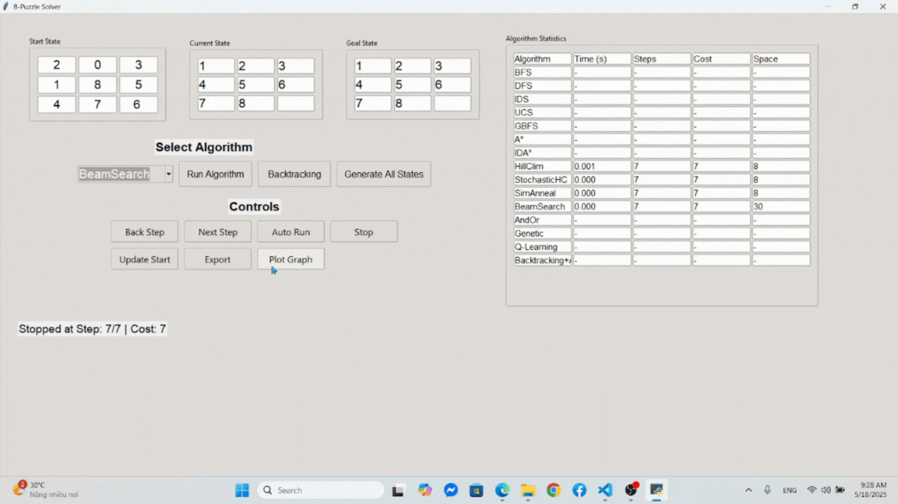
#### 3.6. Kết luận: 
* Beam Search là thuật toán phù hợp trong nhóm thuật toán tìm kiém cục bộ nhờ tốc độ, bộ nhớ thấp và khả năng tạo đường đi tương đối ngắn. Tuy nhiên vẫn, nó vẫn kém so với  các thuật toán như A*, IDA* về tính tối ưu và đầy đủ
* Simulated Annealing phù hợp hơn Hill Climbing và Stochastic Hill Climbing nhờ khả năng thoát cực trị cục bộ, nhưng có thể không hiệu quả bằng Beam Search do thời gian chạy và đường đi dài hơn.
* Hill Climbing không phù hợp lắm vì không tối ưu , dễ kẹt ở cực trị cục bộ, dẫn đến không tìm được lời giải, đặc biệt là khi trạng thái ban đầu xa mục tiêu hoặc nằm trong vùng cực trị cục bộ. Chỉ phù hợp khi trạng thái ban đầu rất gần với mục tiêu, nhưng vẫn không đáp ứng yêu cầu tính tối ưu và đầy đủ.
* Stochastic Hill Climbing: không phù hợp vì không tối ưu, không đầy đủ , mặc dù tính ngẫu nhiên giúp giảm nguy cơ kẹt ở cục bộ nhưng vẫn có khả năng thất bại trong các trạng thái phức tạp của 8Puzzle. Trong không gian trạng thái nhỏ, tính ngẫu nhiên không mang lại lợi thế cao , và việc chọn trạng thái kém có thể làm tăng số bước.
* Genetic Algorithm: không phù hợp do không tối ưu , không đầy đủ (phụ thuộc vào sự đa dạng của quần thể và số thế hệ), thời gian chạy cao do cần đánh giá fitness cho quần thể lớn qua nhiều thế hệ. Bộ nhớ cao hơn so với các thuật toán cùng nhóm,, Phức tạp tong triển khai. Phù hợp với các bài toán lớn hơn như 15 Puzzle.

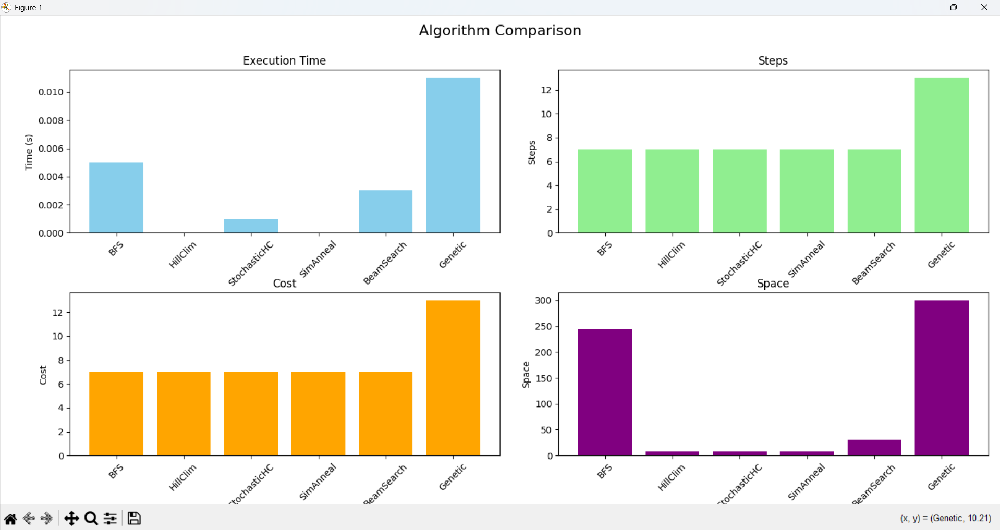

### 4. **Nhóm thuật toán tìm kiếm trong môi trường không xác định**
#### Nondeterministic Enviroments : Đây là nhóm thuật toán được thiết kế để xử lý các bài toán mà kết quả của một hành động không chắc chắn (có thể dẫn đến nhiều trạng thái khác nhau)
#### 4.1. And-or search
  * Khái niệm cơ bản:
    - Trong không gian có 2 loại nút:
      + or nodes: Đại diện cho các lựa chọn của tác nhân (agent). Tác nhân chỉ chọn 1 nhánh con để giải quyết (tương tự như các nút thông thường)
      + and nodes: Đại diện cho kết quả không xác định của 1 hành động. Tác nhân phải giải quyết tất cả các nhánh con
    - Mở rộng nút bằng cách: Chọn hành động tại nút Or , sinh tất cả các trạng thái con tại nút AND, tương ứng với các kết quả có thể. 
  * Mục tiêu:  Là xây dựng một cây giải pháp, một kế hoạch để hướng đến trạng thái mục tiêu
  * Ưu điểm:
    - Xử lý môi trường không xác định
    - Kết quả là một cây giải pháp, cho phép tác nhân chuẩn bị cho mọi kịch bản có thể xảy ra
    - Linh hoạt trong việc xử lý các không gian tìm kiếm phức tạp.
    - Ứng dụng rộng
  * Nhược điểm:
    - Phức tạp và tốn tài nguyên: Việc xây dựng cây giải pháp yêu cầu khám phá nhiều nhánh, dẫn đến chi phí tính toán và bộ nhớ cao
    - Không tối ưu: Kế hoạch có điều kiện có thể dài do phải xử lý tất cả kết quả không xác định, không đảm bảo đường đi ngắn nhất.
    - Khó triển khai : Xây dựng đòi hỏi quản lý cấu trúc dữ liệu phức tạp
    - Thời gian chạy cao : Do khám phá nhiều nhánh AND và OR.
  - 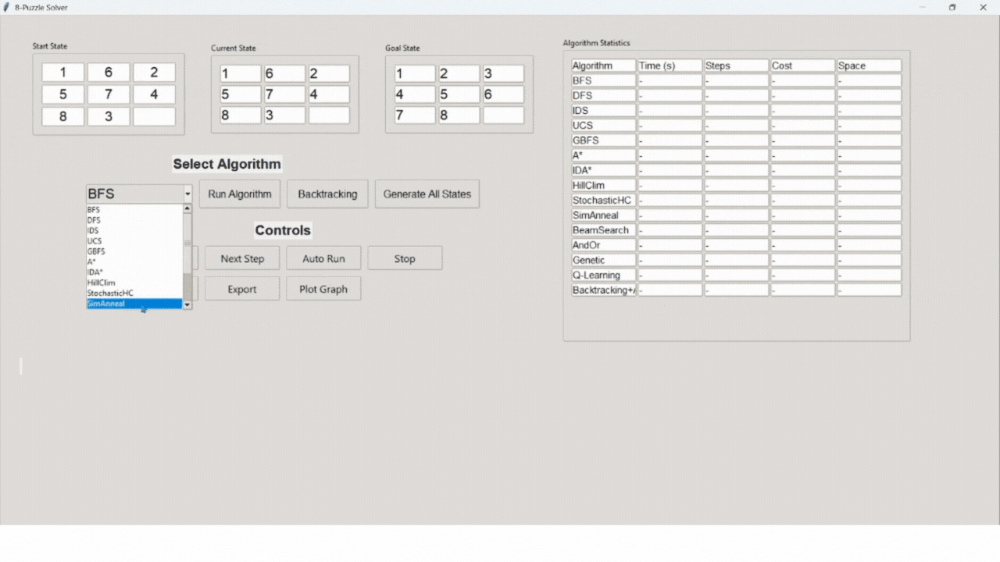 
#### 4.2. Belief Search(Tìm kiếm dựa trên niềm tin)
  * Cách hoạt động: Được thiết kế cho các bài toán trong môi trường không xác định hoặc nhìn thấy một phần, nơi tác nhân không biết chính xác trạng thái hiện tại của mình. Tác nhân duy trì một tập belief state (tập hợp ác trạng thái có thể xảy ra) và cập nhật niềm tin dựa trên hành động và quan sát
  * Các bước hoạt động:
      - Khởi tạo belief state ban đầu và mục tiêu: Bắt đầu với một tập hợp trạng thái có thể xảy ra (dựa vào thông tin ban đầu)
      - Thực hiện hành động
        + Chọn một hành động
        + Dựa trên mô hình chuyển đổi trạng thái, tính toán tập hợp các trạng thái có thể xảy ra sau hành động
      - Cập nhật belief state dựa trên quan sát bằng cách loại bỏ đi những trại không phù hợp
      - Trả về kế hoạch: Kế hoạch là một chuỗi hành động đảm bảo đạt được mục tiêu, bất kể trạng thái thật sự là gì
  * Ưu điểm:
    - Xử lý các bài toán mà tác nhân không biết chính xác trạng thái hiện tại
    - Linh hoạt: Có thể kết hợp với các thuật toán tìm kiếm khác (như A*,BFS,...) trên không gian belief state để tối ưu hóa kế hoạch
    - Nhiều ứng dụng thực tế
  * Nhược điểm:
    - Phức tạp tính toán
    - Không tối ưu : Do cần khám nhiều belief state và xử lý quan sát hạn chế, không đảm bảo đường đi ngắn nhất.
    - Thời gian chạy cao : Do cần tính toán và cập nhật lại belief state sau mỗi hành động và quan sát.
    - Tốn bộ nhớ: Belief state có thể tăng trường theo cấp số nhân, dẫn đến khó khăn trong việc lưu trữ và xử lý
    - Khó triển khai
#### 4.3. Kết luận: 
* And-or Search:
  *  And-or Search là lựa chọn tốt khi 8 Puzzle đặt trong môi trường không xác định, nơi cần lập danh sách có điều kiện để đạt được trạng thái đích.
  *   Không phù hợp: Không tối ưu so với yêu cầu tìm đường đi ngắn nhất, thời gian chạy cao, phức tạp không cần thiết (với không gian trạng thái nhỏ của 8Puzzle), việc xây dựng cây AND-OR tốn nhiều tài nguyên hơn so với các thuật khác. Hạn chế trong môi trường  xác định (8Puzzle được giải trong môi trường xác định , không mang lại lợi thế cao so với các thuật toán khác).
*  Belief state:
  * Phù hợp với môi trường không xác định hoặc quan sát một phần, có thể tìm được lời giải nếu belief state hội tụ về trạng thái mục tiêu và tài nguyên đủ lớn.
  * không phù hợp : Không tối ưu do xử lý nhiều trạng thái trong belief state, Thời gian chạy cao, Bộ nhớ lớn , Phức tạp không cần thiết (Với 8Puzzle truyền thống (quan sát đầy đủ), Belief state Search quá phức tạp).
* **Lựa chọn ưu tiên: And-or Search là thuật toán tốt hơn trong nhóm thuật toán tìm kiếm trong môi trường không xác định cho 8 Puzzle nhờ thời gian chạy nhanh, bộ nhớ thấp, khả năng tạo kế hoạch có điều kiện hiệu quả. Sử dụng với hành động rõ ràng.**
### 5. **Nhóm thuật toán có ràng buộc điều kiện**
#### Định nghĩa: 
  * Biến (Variables) : Các đối tượng cần giá trị (Ví dụ: các ô trong lưới 8-Puzzle)
  * Miền giá trị (Domains): Tập hợp các giá trị có thể gán (ví dụ: các số từ 0 - 8 trong bài toán 8-Puzzle)
  * Ràng buộc (Constraints): Các điều kiện mà các biến phải thỏa mãn (vú dụ: Mỗi ô trong 8-Puzzle phải là duy nhất)
  * Mục tiêu: Tìm cách gán giá trị cho tất cả các biến sao cho thỏa mãn tất cả các ràng buộc trên
#### 5.1. Backtracking Search (Tìm kiếm quay lui):
  * Cách hoạt động: đệ quy để thử các giá trị cho từng biến, quay lui (backtrack) khi gặp đường cụt
  * Ưu điểm:
    - Đơn giản và dễ triển khai
    - Đảm bảo tìm được lời giải nếu có
    - Tốn ít bộ nhớ
    - Linh hoạt : Có thể tích hợp các cải tiến như chọn biến tối ưu hoặc sắp xếp giá trị trước.
  * Nhược điểm:
    - Hiệu suất thấp: Backtracking thử tất cả các khả năng 1 cách mù quáng, dẫn đến thời gian có thể chạy rất lâu nếu không gian tìm kiếm lớn
    - Không tối ưu: không đảm bảo tìm được đường đi ngắn nhất
  * Độ phức tạp:
    - Thời gian: Phụ thuộc vào số biến và kích thước miền giá trị
    - Bộ nhớ: Lưu trạng thái hiện tại và miền giá trị.
  - 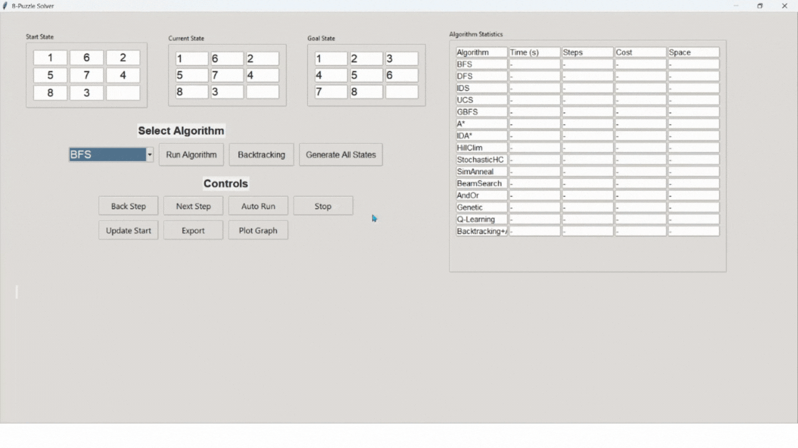
#### 5.2. AC-3  
  * Cách hoạt động: Thuật toán nhằm kiểm tra giữa các cặp biến cố ràng buộc, loại bỏ các giá trị trong miền giá trị không thỏa mãn ràng buộc.
  * Ưu điểm: 
    * Giảm không gian tìm kiếm: Thu hẹp miền giá trị trước khi Backtracking về, giảm số gán giá trị cần thử.
    * Bộ nhớ thấp: Chỉ lưu hàng đợi và miền giá trị
    * Hiệu quả với ràng buộc: Ràng buộc trong 8 Puzzle dễ kiểm tra, giúp AC-3 nhanh chóng loại bỏ giá trị không hợp lệ.
    * Tăng tốc Backtracking
  * Nhược điểm: 
    * Không tối ưu 
    * Thời gian chạy vẫn cao
    * Hạn chế với các ràng buộc khả thi
    * Không tận dụng cấu trúc bài toán : Bỏ qua cấu trúc di chuyển của ô trống, kém hiệu quả so với các thuật toán tìm kiếm trạng thái khác như A* , IDA* 
  * 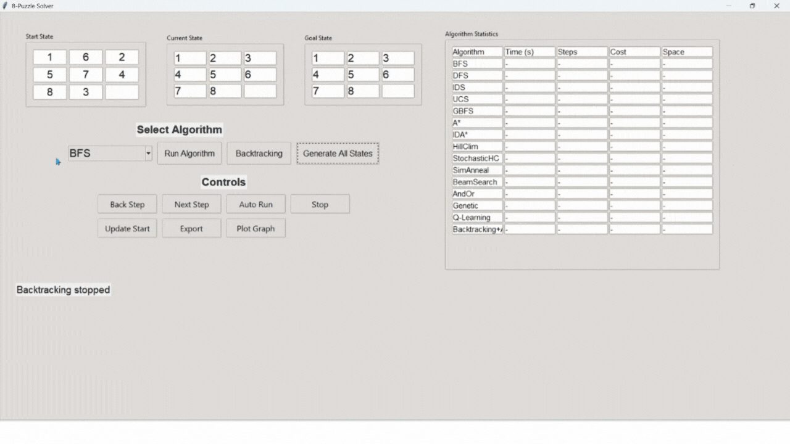
#### 5.3. generate_all_states 
  * Cách hoạt động: Trong bài toán 8 Puzzle, bảng 3x3 có giá trị 9 ô, chứa các giá trị {0, 1, ..., 8}, với 0 là ô trống. Tổng số hoán vị của 9 giá trị là (9!) , nhưng chỉ 1 nửa là khả thi về tính chẳn lẽ hoán vị. Một trạng thái là khả thi nếu có cùng tính chẵn lẽ với trạng thái mục tiêu, được xác định bởi:
    * Số lần nghịch đảo
    * Tính khả thi
  * Ưu điểm:
    * Đầy đủ: Tạo tất cả các trạng thái khả thi, đảm bảo không bỏ sót trạng thái hợp lệ
    * Tích hợp với các thuật toán khác để lọc trạng thái
    * Kiểm tra tính khả thi chính xác: Đảm bảo chỉ giữ lại các trạng thái khả thi.
  * Nhược điểm:
    * Thời gian chạy cao
    * Bộ nhớ lớn
    * không cần thiết trong tìm kiếm trạng thái
    * Hiệu suất thấp đối với các bài toán lớn
  * 
#### 5.4. Kết luận:
* AC-3 Backtracking Search: Phù hợp hơn trong nhóm thuật toán tìm kiếm có điều kiện ràng buộc do đã giảm nhánh và miền giá trị theo điều kiện ràng buộc, nhưng vẫn kém hiệu quả so với các thuật toán tìm kiếm trạng thái hoặc cục bộ.
* BackTracking Seach: Ít phù hợp hơn do thời gian chạy cao và số trạng thái khám phá nhiều.
* Generate_all_state: Cung cấp không gian trạng thái đầy đủ, giảm số trạng thái khám phá , hỗ trợ ràng buộc khả thi nhưng chi phí rất cao và không cần thiết.
### 6. Nhóm thuật toán Reinforcement Learning - RL (học củng cố)
#### 6.1. Q-Learning 
* Cách hoạt động : Q-Learning học một bảng giá trị Q, Q(s,a), biểu thị giá trị kỳ vọng của việc thực hiện hành động (a) ở trạng thái (s), sau đó tuân theo các chính sách tối ưu. Thuật toán cập nhật dựa trên công thức : Q(s,a) += alpha * (R + gamma * max( Q(s',a') - Q(s,a)))
  * (s) : Trạng thái hiện tại
  * (a) : Hành động được chọn
  * (R) : Phần thưởng nhận được
  * (s') : Trạng thái tiếp theo
  * (alpha): Tỷ lệ học, tỷ lệ để khám phá
  * (gamma): Hệ số chiết khấu
* Quá trình thực hiện:
  * Khởi tạo Q-Table với giá trị ban đầu.
  * Trong mỗi lần huấn luyện , cập nhật lại Q - Table theo công thức trên
  * Lặp lại nhiều lần cho đến khi Q-Table hội tụ
  * Sử dụng Q-Table để chọn chuỗi hành động tối ưu từ trạng thái ban đầu đến mục tiêu.
* Ưu điểm:
  * Tính đầy đủ (sau hội tụ): Nếu huấn luyện đủ lâu, Q-Learning đảm bảo tìm được chính sách dẫn đến trạng thái đích nếu có lời giải.
  * Có thể áp dụng cho nhiều trạng thái ban đầu
  * Có thể mở rộng trong môi trường không xác định
* Nhược điểm:
  * Không tối ưu: Đường đi dài trong giai đoạn khởi đầu, chỉ đạt gần tối ưu khi huấn luyện đủ lâu
  * Thời gian huấn luyện cao
  * Bộ nhớ lớn 
  * Hiệu suất phụ thuộc vào tham số và mức thưởng đề ra
  * Khó hội tụ với không gian lớn
* 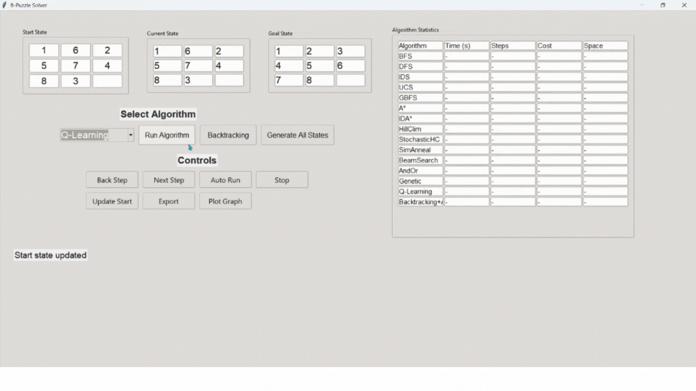
#### Kết luận: 
* Phù hợp:
  * Tính đầy đủ (sau hội tụ): Đảm bảo tìm được đường đi đến mục tiêu nếu huấn luyện đủ lâu
  * Học chính sách cho mọi trạng thái, hữu ích khi cần giải nhiều trường hợp 8 Puzzle
  * Mở rộng cho các môi trường phức tạp
* Nhận xét: Q-Learning phù hợp cho các bài toán cần học dài hạn, nhưng không hiệu quả trong 8-puzzle do không gian trạng thái lớn và yêu cầu tính tối ưu nhanh.  

## VII. Kết luận
Đồ án cá nhân môn Trí tuệ nhân tạo tập trung vào việc áp dụng các nhóm thuật toán tìm kiếm để giải bài toán 8-Puzzle, một bài toán kinh điển trong lĩnh vực trí tuệ nhân tạo, nhằm tìm đường đi ngắn nhất từ trạng thái ban đầu đến trạng thái mục tiêu. Quá trình tìm kiếm được triển khai bằng 6 nhóm thuật toán tìm kiếm: Nhóm thuật toán tìm kiếm không có thông tin, Nhóm thuật toán tìm kiếm có thông tin, Nhóm thuật tìm kiếm toán cục bộ, Nhóm thuật toán tìm kiếm trong môi trường không xác định, Nhóm thuật toán có ràng buộc điều kiện, Nhóm thuật toán Reinforcement Learning - RL (học củng cố).

Một điểm sáng của dự án là giao diện người dùng được xây dựng bằng Tkinter, cho phép nhập trạng thái khởi tạo, chọn thuật toán và theo dõi quá trình giải bài toán qua các hình ảnh động kèm bảng hiển thị trạng thái. Giao diện này giúp thể hiện rõ ràng cơ chế hoạt động của từng thuật toán, đồng thời tăng tính tương tác, tạo điều kiện cho người dùng và người học nắm bắt sâu hơn về cách các phương pháp trí tuệ nhân tạo vận hành.

Qua quá trình thực nghiệm, các thuật toán đã được đánh giá dựa trên các tiêu chí: thời gian thực thi, số bước di chuyển tối ưu, độ phức tạp không gian và khả năng tìm lời giải trong các trường hợp trạng thái ban đầu khác nhau. Mỗi nhóm đều có đặc trưng, ưu, nhược điểm và cách tìm kiếm khác nhau, tạo nên sự dạng trong bài toán tìm kiếm không chỉ trong 8 Puzzle mà còn nhiều những vấn đề khác. Nhưng đối với bài tóan 8 Puzzle thì nhóm thuật toán heuristic, A* với heuristic Manhattan Distance nổi bật với hiệu suất vượt trội, không chỉ tìm được đường đi ngắn nhất mà còn giảm đáng kể thời gian tính toán nhờ chiến lược lựa chọn nút thông minh. Ngoài ra với Q-Learning khi đã được huấn luyện đủ lâu thì cũng cho ra kết quả rất nhanh và chính xác.

Đồ án không chỉ giúp củng cố kiến thức lý thuyết về các thuật toán tìm kiếm mà còn rèn luyện kỹ năng lập trình, phân tích và so sánh hiệu quả thuật toán trong thực tiễn. Những hạn chế gặp phải, như vấn đề mở rộng không gian trạng thái trong các bài toán phức tạp hơn hoặc chi phí tính toán của heuristic, đã mở ra hướng nghiên cứu sâu hơn về cải tiến thuật toán, chẳng hạn như sử dụng heuristic phức tạp hơn hoặc kết hợp các phương pháp tìm kiếm hiện đại. Đồ án là bước đệm quan trọng để tiếp cận các bài toán trí tuệ nhân tạo thực tế, từ đó thúc đẩy sự phát triển của các ứng dụng thông minh trong tương lai.

  

